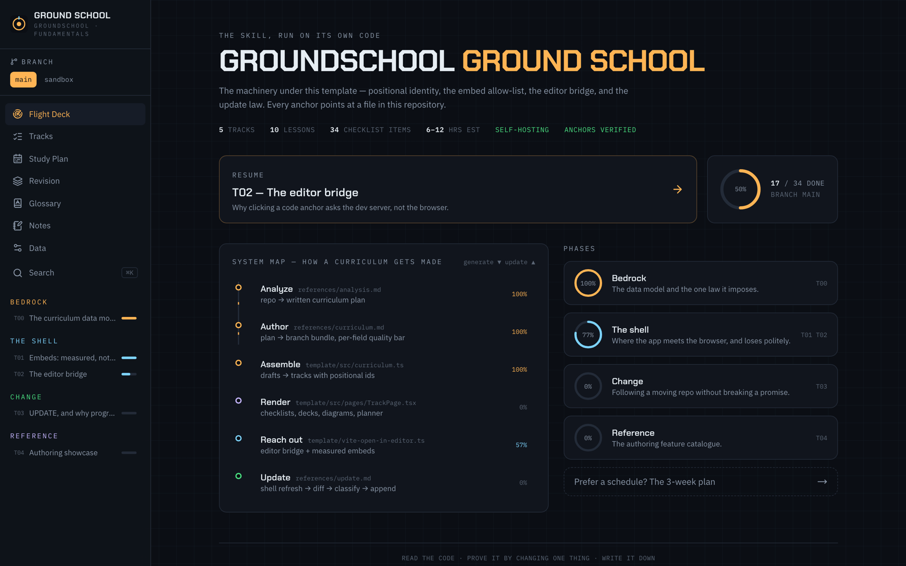
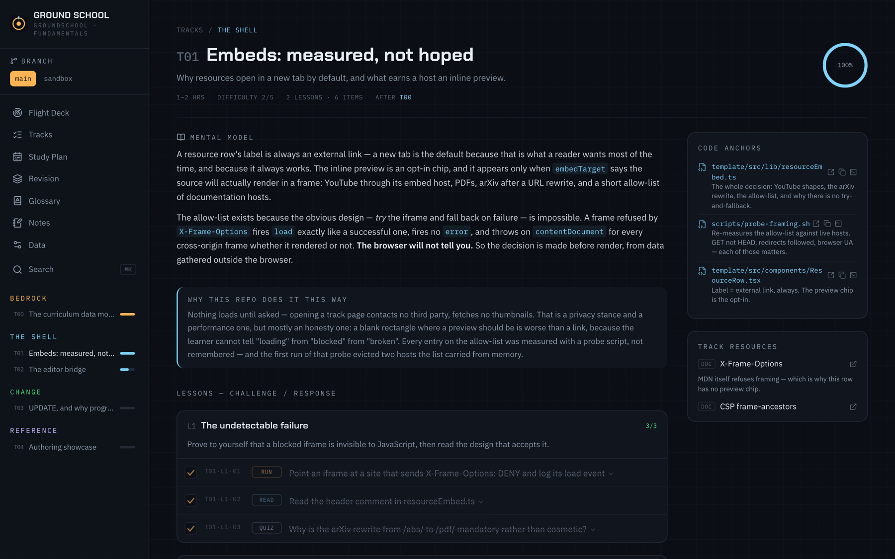
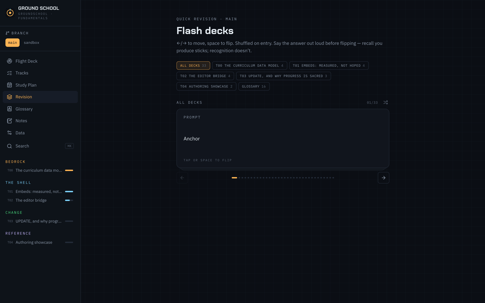
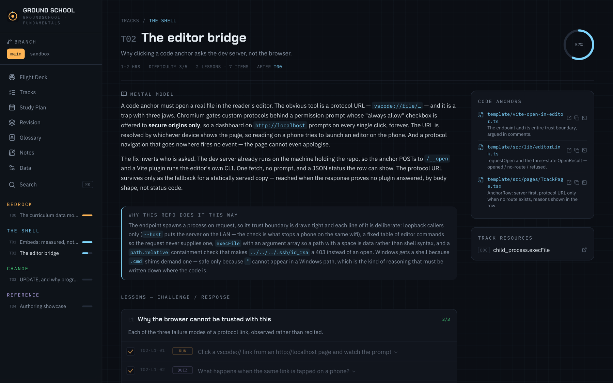
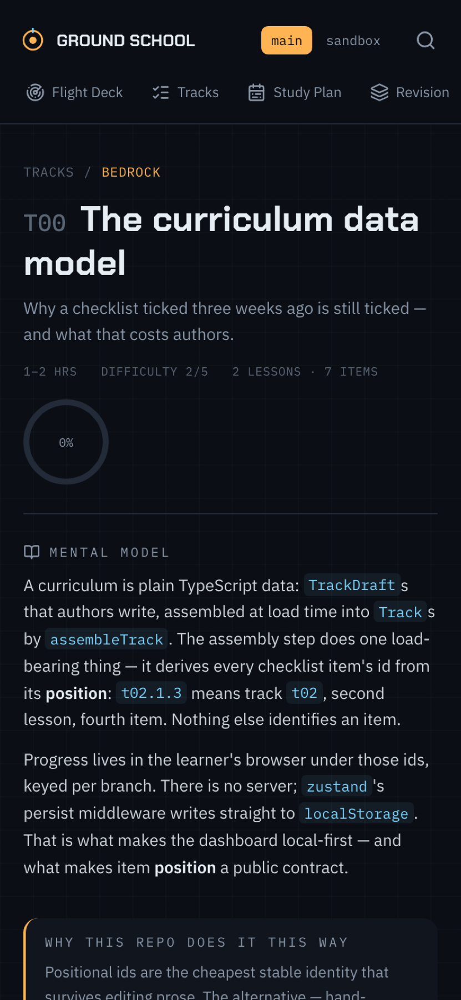

# groundschool

A Claude Code skill that reads a repository and writes you a course about it.

Not a file tour and not a generated README — a curriculum about the **fundamentals underneath
the code**, rendered as a local-first app that lives at `<repo>/groundschool/` and remembers
where you got to.



<sub>Fully self-hosting: the screenshots on this page are the skill run on **its own repository** —
five tracks about the template's actual machinery, every code anchor a real file here.</sub>

---

## What it produces

Point it at a repo. It reads the code, the tests, the docs and the commit history, works out
what a person would have to understand to extend the thing, and writes:

- **Tracks** grouped into phases, each with a mental model, a *why this repo does it this way*
  argument, and code anchors that open the real file in your editor.
- **Lessons** as challenge/response checklists — six typed kinds (`READ` `RUN` `BUILD` `QUIZ`
  `WRITE` `WATCH`), each one checkable, quiz answers hidden until you ask.
- **Checkrides** — per-track exams with explanations and a persisted best score.
- **Flash decks** for spaced recall, per concept, plus the glossary as its own deck.
- **Architecture diagrams** drawn from the repo's own structure, inline and zoomable.
- **Notes, a study plan, and progress** that survives a reload and stays in your browser.



Curricula live per branch and coexist. A repo with a `main` and a `feature/x` gets one
dashboard, two curricula, a switcher, and separate progress for each.

<table>
<tr>
<td width="50%"></td>
<td width="50%"></td>
</tr>
</table>

## How this relates to `learn`

Claude Code ships an official **`learn`** skill, and it is good. It teaches by conversation:
you ask, it explains, it notices what you did not follow, it quizzes you, it lays out a
learning path. It works on any subject and it meets you exactly where you are.

groundschool is not a replacement for that, and it would be dishonest to sell it as one.
It is a **superset of `learn`'s artifacts across exactly one subject — a repository — and a
subset of its method.**

| | `learn` | groundschool |
|---|---|---|
| Subject | anything | one codebase |
| Shape | a conversation | an app on disk |
| Adapts to you | yes, continuously | no — a fixed curriculum you work through |
| Anchored to real files | no | every track, verified to exist |
| Still there in three weeks | no | yes, with your progress |

The trade is deliberate. Adaptivity is `learn`'s whole strength and groundschool gives it up
entirely; in exchange it gets persistence, code anchors, and a curriculum that is a *reviewable
artifact* rather than a transcript. Use `learn` when you have a question. Use groundschool when
you have a repository and a month.

## Install

```bash
git clone https://github.com/brickster241/groundschool-skill.git
ln -s "$PWD/groundschool-skill" ~/.claude/skills/groundschool
```

Claude Code picks it up from `~/.claude/skills/`. Then just ask:

```
build a ground school for this repo
```

```
update the ground school — I've moved a lot since the baseline
```

The generated app needs Node `^20.19` or `>=22.12` (Vite 8's floor). No API keys, no accounts,
no telemetry. The only thing it talks to is its own dev server, and only to open a file in your
editor; embedded videos and papers load nothing until you click them.

## The two modes

**GENERATE** analyses the repo into a written curriculum plan first — system map, track table,
per-track anchors, the external knowledge each track needs — and refuses to start authoring
until that plan exists. Authoring against a vague plan is how you get documentation instead of
curriculum.

**UPDATE** syncs an existing ground school with a moved repo, under one law: *the learner's
progress is sacred.* Progress is keyed on positional IDs and lives in a browser the tool cannot
see, so every item has to be assumed mid-flight. Nothing is ever deleted, reordered or
renumbered. Content leaves by **deprecation** — a dated banner explaining what happened and
where the replacement is — never by disappearing.

UPDATE also re-syncs the app shell, because a generated dashboard is a *copy* of the template,
not a link to it. Without that step every dashboard keeps the bugs it was born with, and the
person reading it has no way to know a fix exists.

## Things that had to be measured, not assumed

The interesting problems here were not React. They were about what browsers actually do, and
most of them punished the obvious guess.

**A blocked iframe is invisible to JavaScript.** The tempting design is "try to embed, fall
back to a link on failure". There is no failure to catch: for a frame refused by
`X-Frame-Options`, the `load` event fires exactly as it does on success, no `error` event is
dispatched, and reading `contentDocument` throws for *every* cross-origin frame whether it
rendered or not. The decision has to be made before render, so embedding runs off an
allow-list — and [`scripts/probe-framing.sh`](scripts/probe-framing.sh) re-measures that list
so it stays falsifiable. Writing the probe immediately caught two entries I had put on the list
from memory: `pkg.go.dev` sends `X-Frame-Options: deny`, and `datatracker.ietf.org` scopes
`frame-ancestors` to the IETF's own domains. Measuring beats remembering, which is the whole
argument for keeping the probe in the repo.

**arXiv's `/abs/` page and its `/pdf/` URL disagree.** `/abs/` — the URL everyone pastes —
sends both `frame-ancestors 'none'` and `X-Frame-Options: SAMEORIGIN`; `/pdf/` sends neither
and is served `content-disposition: inline`. So papers preview inline only because the link is
rewritten first. That rewrite is load-bearing, not cosmetic.

**Chromium will not let `http://localhost` remember a protocol handler.** Code anchors used to
be `vscode://file/…` links. The permission prompt they raise offers its "always allow"
checkbox to secure origins only, so a dashboard on localhost prompts *every single time*; the
URL is resolved by whichever device is showing the page, so reading on a phone over
`vite --host` tries to launch an editor on the phone; and a protocol navigation that goes
nowhere fires no event, so the page cannot even apologise. The fix was to stop asking the
browser: [a Vite plugin](template/vite-open-in-editor.ts) exposes `POST /__open` and runs the
editor's own CLI, because the server is already on the machine holding the repo. Loopback
callers only, a fixed table of editor commands rather than one from the request, `execFile`
with an argument array, and paths that must resolve inside the documented repo. The protocol
URL survives as the fallback for a statically served copy.

**`navigator.clipboard` does not exist off a secure context.** The dev server binds `--host` so
you can read the material on a phone — which means a LAN-IP origin, which means the clipboard
API is simply absent. A copy button that flashes a green tick while copying nothing is how you
paste the wrong thing into a terminal, so `copyText` returns a boolean the UI has to respect,
and on failure it reveals the selectable text instead.

**`url(#arrow)` resolves to the first match in document order.** Every diagram is injected
twice — once inline, once in the lightbox — and hand-drawn SVGs reuse obvious ids (`arrow`,
`grad`, `clip`). Sharing them makes one diagram silently borrow another's marker, which reads
as a rendering bug on your machine rather than a bug in the app. Ids are namespaced per
instance, parsed as HTML rather than XML on purpose: a diagram using `xlink:href` without
declaring `xmlns:xlink` is valid HTML and malformed XML, and the strict parser would have
skipped the rewrite silently.

## Reading it on a phone

The dev server binds `--host`, so the dashboard is reachable from anything on the same
network — which is where a lot of the reading actually happens.



Two things genuinely cannot work from another device, and the app says so rather than failing
quietly: an editor link would open on the phone, not the machine with the repo, and the
clipboard API needs a secure context. Both fall back to selectable text.

## Platforms

macOS, Linux and Windows. The only platform-sensitive part is the editor bridge, and it is
handled where it bites: Windows editor CLIs are `.cmd` shims that Node refuses to spawn without
a shell, so the plugin uses one there — safe precisely because `"` cannot appear in a Windows
path and the command itself comes from a fixed table. Editor URLs normalise `C:\` paths to the
`vscode://file/c:/…` form, and JetBrains gets its line number as a separate argument because
splitting `C:\repo\main.go:12` on `:` is not a thing that can be done.

## Layout

| Path | What it is |
|---|---|
| `SKILL.md` | Entry point — modes, stages, gates, the quality bar |
| `references/analysis.md` | Repo → curriculum plan: the branch gate, source priority, the spine |
| `references/curriculum.md` | Authoring spec: voice, per-field bar, the append-only ID law |
| `references/design.md` | The night-cockpit design system; what is fixed vs per-repo |
| `references/update.md` | Incremental sync: refresh shell → diff → classify → deprecate/append |
| `scripts/probe-framing.sh` | Re-measures the embed allow-list against live hosts |
| `template/` | The app — Vite 8 + React 19 + TS + Tailwind v4 + Motion + zustand |

The template builds standalone against an example curriculum that exercises every authoring
feature, so it can be verified without generating anything:

```bash
cd template && npm install && npm run build
```

## The one rule for the generated app

`src/branches/**` belongs to your repo. Everything else under `src/` belongs to the skill and
gets overwritten on the next UPDATE. If the shell needs to change, change the template — a
fix made in one instance helps one person once.

## Roadmap

- **Animated segments for the genuinely hard topics.** The diagrams are static SVG today;
  for material where motion carries the idea (consensus rounds, cache line behaviour, merge
  frontiers), pre-rendered animation clips — Manim or similar — served as local video with the
  same nothing-loads-until-clicked rule. Rendered at generate time, so readers never need the
  toolchain.
- **An anchor linter** that re-verifies every `path`/`line` in a curriculum against the repo,
  as a single command — today this lives inside the UPDATE protocol only.
- **Import/export of progress** between browsers, since the data is one JSON blob already.

## Origin

Built to learn one specific repository properly, then generalized when it became obvious the
same workflow applied to every repo worth understanding deeply. It has since been run against
a Git implementation, an HTTP server, a JSON parser and a flight-simulation stack — which is
where most of the sharp edges above came from.

MIT — see [LICENSE](LICENSE).
